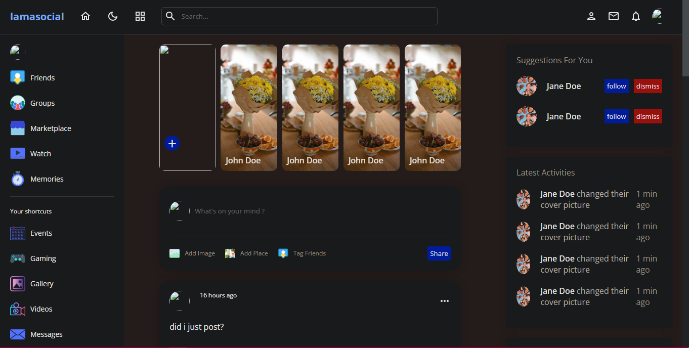
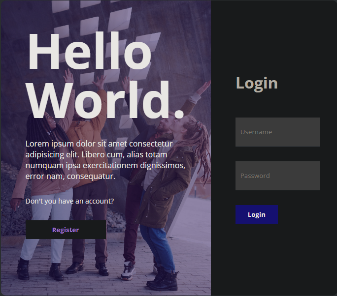
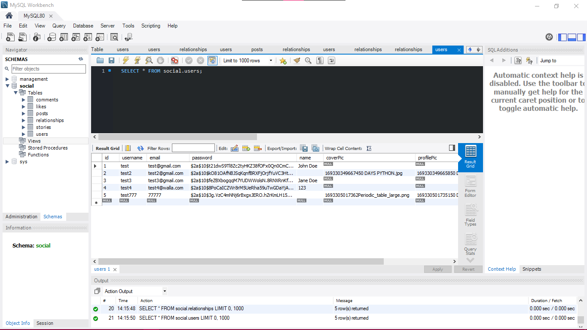

# Social-Website-Fullstack
React Node.js MySQL 

This project focuses on building a social media profile page using React for the frontend and Node.js with Express.js for the backend. Key features include displaying user information, posts, and allowing users to follow/unfollow others. JSON Web Tokens (JWT) are used for authentication, and data fetching is optimized using the @tanstack/react-query library.

Challenges included managing userId handling, constructing proper API URLs, and displaying images correctly. Debugging and logging were utilized to troubleshoot issues.

The project is designed to create a functional social media profile page with user interaction capabilities.

